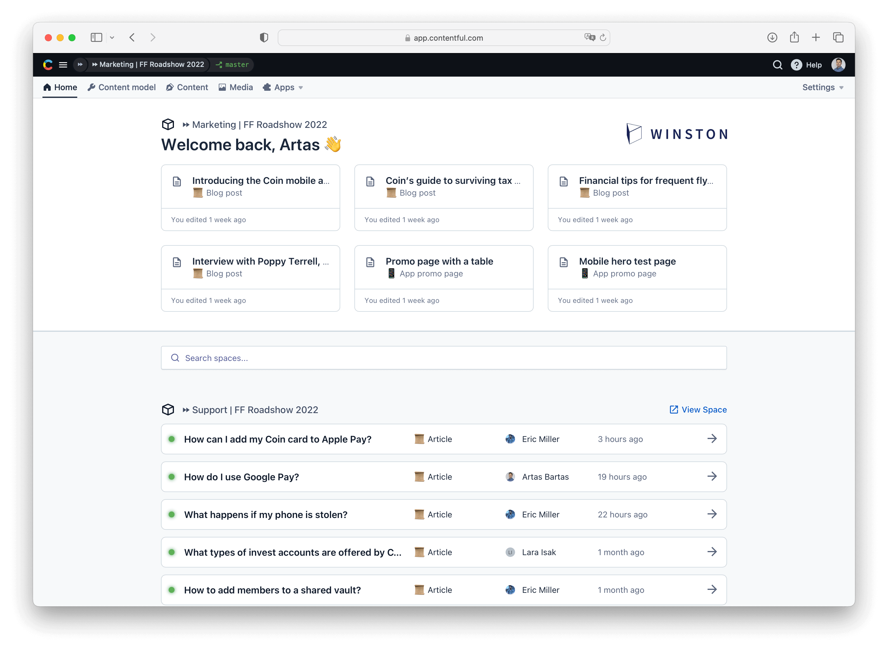
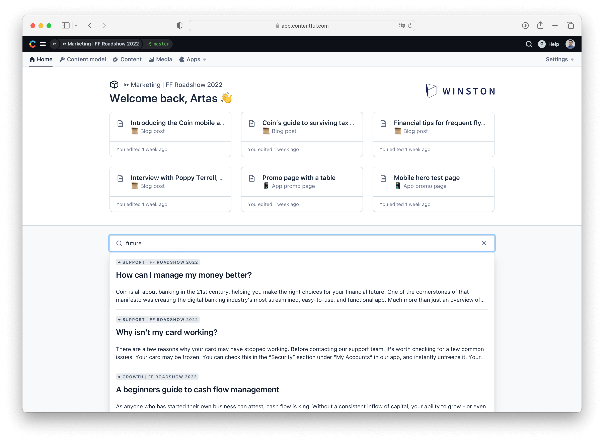
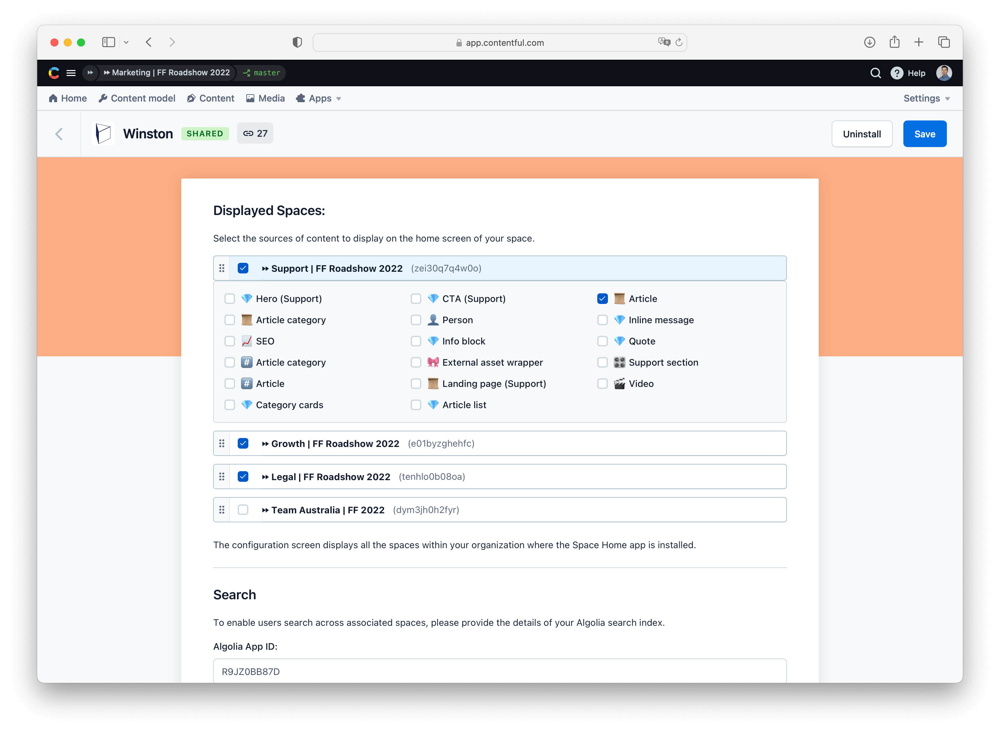
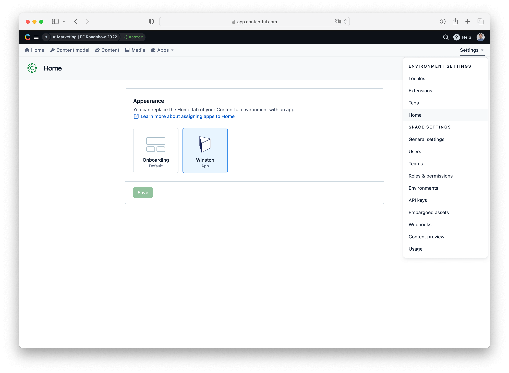

# Winston

The Winston app visualizes publishing activity from associated spaces on the homepage of the current space. Users can view cards representing the entries they recently edited and lists of items published in associated spaces as well as search through all the spaces using the unified search bar. 

Clicking on the search results takes the user into the entry editor of the source space, where the entry can be viewed in its entirety.

The Winston app allows users to determine what spaces and content types should be featured in the published content feed. The app configuration screen will list all the spaces within the current organization where the Winston app is installed, allowing the admin to select relevant spaces by checking the checkbox. As a next step, select the content types that should be featured in the app. Keep in mind that for UX reasons the app displays the last six entries published in the space.

To install the app in your space, use a public installation URL XXXX or fork the app codebase and create your own app definition. The app utilizes homepage location that can be customized by selecting the app under the Home menu item in the space settings. 

Under the hood, the Winston app utilizes [orchestration features](https://www.contentful.com/help/enable-spaces-for-orchestration/) to federate content, [Algolia integration](https://www.algolia.com/developers/code-exchange/backend-tools/integrate-contentful-with-algolia/) to provide the search experience, and the [app framework](https://www.contentful.com/developers/docs/extensibility/app-framework/) to package functionality of use within the space. To use the app in your organization, make sure that your subscription includes access to orchestration features, your spaces are enrolled in the orchestration fleet, and you have a working Algolia application.

Note that Contentful does not provide any support or SLA on the app usage and it should be used at your own risk.
